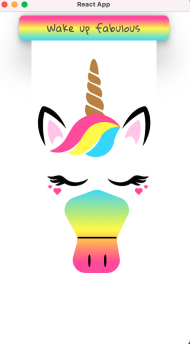
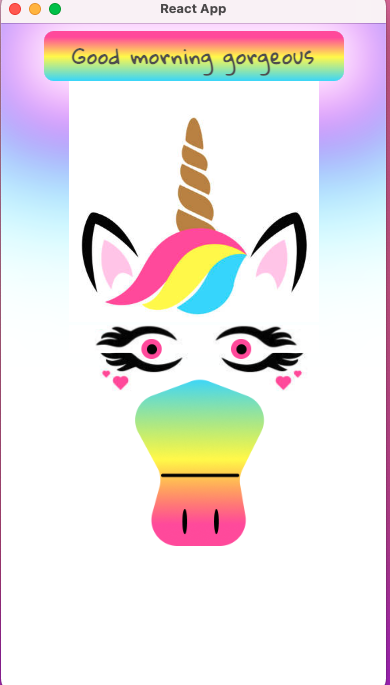
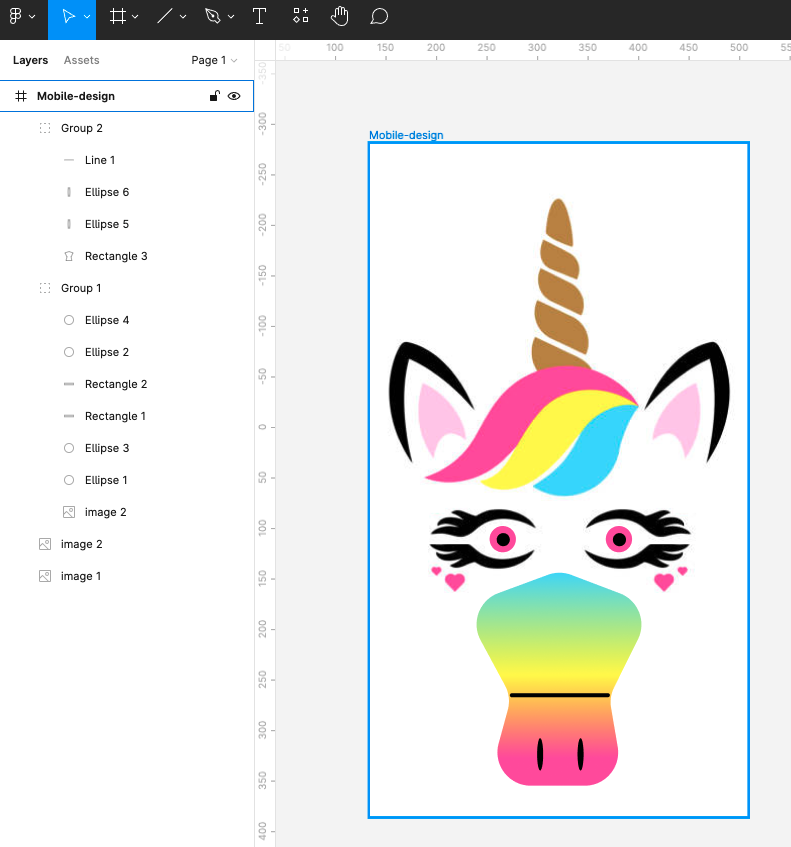

# The blinking Unicorn - Showcase with React

This is my showcase to the [ Blinking Unicorn](https://unicorn-blinking.netlify.app). Enter the website, click the button and wake up the Unicorn 🦄

## Table of contents

- [The blinking Unicorn - Showcase with React](#the-blinking-unicorn---showcase-with-react)
  - [Table of contents](#table-of-contents)
  - [Overview](#overview)
    - [The challenge](#the-challenge)
    - [Screenshot & spoiler alert 😅](#screenshot--spoiler-alert-)
    - [Links](#links)
    - [How to clone the Repository 🧐](#how-to-clone-the-repository-)
    - [Built with](#built-with)
    - [What I learned](#what-i-learned)
  - [Author](#author)

## Overview

### The challenge

Users should be able to:

- understand better the useState hook with a simple example
- review conditional styling in React environment
- test the conditional greeting using the ternary operator

### Screenshot & spoiler alert 😅

Still sleeping Unicorn's version:



Awake Unicorn's version:



The figma's screen shoot:



### Links

- Live Site URL: [blinking Unicorn](https://blinking-unicorn.netlify.app)

### How to clone the Repository 🧐

1.  Use the code button in the Repository to clone it into your machine.
2.  Install the npm package using the terminal

```
$ npm install
```

3. Enjoy the code snippet and don't hesitate to change the code to practice more

<br/>

### Built with

- Semantic HTML5 markup
- CSS custom properties
- vanilla.JS
- React.JS

- [Firma](https://www.figma.com/file/ybdtf5RieEGlvjtlCQ34M5/unicorn_blinking?node-id=0%3A1) - Self made Firma Wireframe, open the link and try to create this project from scratch

- [Conditional Styling](https://dev.to/salehmubashar/conditional-styling-in-react-js-3h52) - a great article about conditional styling in React.js

<br/>

### What I learned

- How to use ternary operator with more conditions then usual:

  ```
    setGreeting(
      time > 6 && time < 12
        ? 'Good morning gorgeous'
        : time > 12 && time < 16
        ? 'Continue to do your stuff darling'
        : time > 16 && time < 21
        ? 'Good Evening stunning'
        : 'It is late, go to sleep!'
    );
  ```

  - How to use conditional styling as a variable and implement it as inline style attribute inside the HTML element.

  ```
  const style = {
    opacity: !openEyes ? 0 : 1,
  };

   
  ```

## Author

- LinkedIn - [@moran_thaler](www.linkedin.com/in/moran-thaler)
